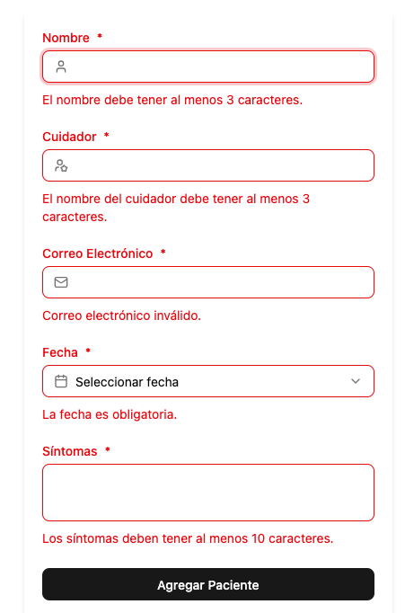

# 🐾 Veterinaria - Gestión de Pacientes

Aplicación web para la **gestión de pacientes de una veterinaria**, desarrollada con **React**, **TypeScript** y el ecosistema moderno de herramientas UI y de estado.  
Permite **crear, editar y eliminar pacientes**, con una experiencia de usuario fluida y moderna.

---

## 🚀 Tecnologías utilizadas

- ⚛️ **React** – Librería principal para la construcción de interfaces.
- 🧩 **TypeScript** – Tipado estático para mayor robustez y mantenibilidad.
- 🎨 **shadcn/ui** – Librería de componentes UI moderna y personalizable.
- 🪝 **react-hook-form** – Manejo eficiente y escalable de formularios.
- 🧠 **Zustand** – Gestión de estado simple y poderosa.
- ✅ **Zod** – Validación de esquemas y tipado seguro.

---

## ✨ Características principales

- 💾 **Persistencia local:**  
  Los datos de los pacientes se almacenan en **LocalStorage**, evitando la necesidad de un backend.

- 🔔 **Notificaciones visuales:**  
  Muestra **toast notifications** al crear, editar o eliminar pacientes, mejorando la retroalimentación del usuario.

- 🧱 **Componentes personalizados:**  
  Implementa **wrappers** sobre los componentes de `shadcn/ui` para mantener consistencia visual y reutilización.

---

## 📸 Vista previa



---

## ⚙️ Instalación y uso

1. Clona el repositorio:

   ```bash
   git clone https://github.com/Faridleo1998/pacientes-react.git
   cd veterinaria-pacientes
   ```

2. Instala las dependencias:

   ```bash
   pnpm install
   ```

3. Inicia el entorno de desarrollo:

   ```bash
   pnpm run dev
   ```

4. Abre en tu navegador:  
   👉 [http://localhost:5173](http://localhost:5173)

---

## 🧠 Estado global con Zustand

El proyecto utiliza **Zustand** para manejar el estado global de pacientes, incluyendo:

- Lista de pacientes.
- Paciente seleccionado para editar.
- Acciones para agregar, actualizar o eliminar.

---

## 🧾 Validación de formularios

Los formularios se construyen con **react-hook-form** y **Zod**, lo que garantiza:

- Validación declarativa y tipada.
- Mejor experiencia de usuario al mostrar errores en tiempo real.